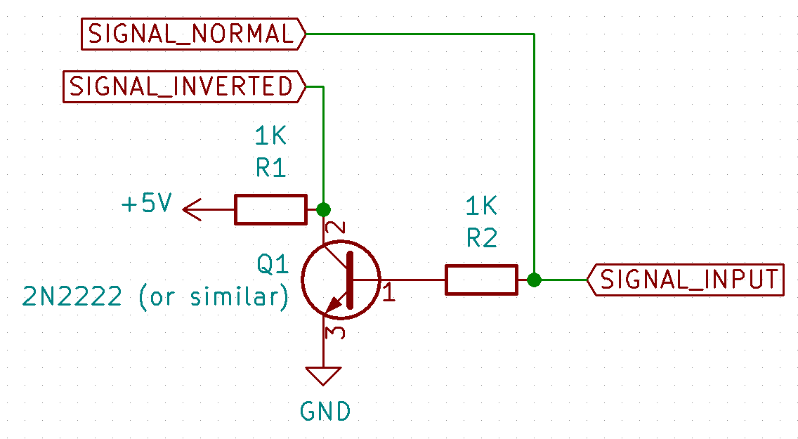
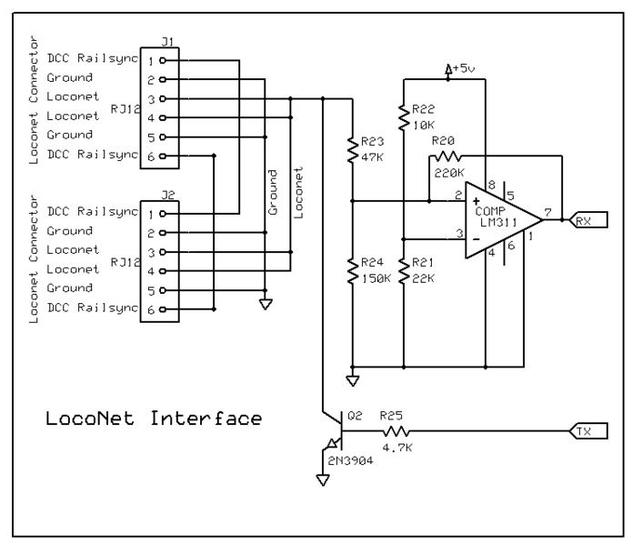

# What is DCC++ESP32?
DCC++ESP32 is an open-source hardware and software Command Station for the operation of DCC-equipped model railroads.

The DCC++ESP32 Command Station consists of an ESP32 micro controller connected to at least one Motor Shield that can be connected directly to the tracks of a model railroad.

## Whats in this Repository
This repository, DCCppESP32, contains a complete DCC++ESP32 Command Station code designed for compiling and uploading into an ESP32. All source files are in the folder named src and header files are under include (including index_html.h which is generated during the build in PlatformIO IDE, for Arduino IDE be sure to download the latest released version of this file and place it in the include directory).

To utilize this code, download a release zip file from this repository and open the included project file in PlatformIO IDE, and the dependent libraries listed under the "lib" folder (see the readme.txt file for details). No code modifications should be required *EXCEPT* for configuring which features you want to use, see the [Building DCC++ESP32](#building-dccesp32) section further down for specifics.

The latest production release of the code is 1.2.2:
* Supports almost any variant of the ESP32.
* Built-in configuration for both the original Arduino Motor Shield, Pololu MC33926 Motor Shield or BTS7960B based Motor Shield.
* Built-in web interface for controlling locomotives or configuring the DCC++ESP32 Command Station.
* Built-in support for LCC either via WiFi or a hardware CAN transceiver, please see the section below on LCC if you intend on using this feature.

Detailed diagrams showing connections to the supported Motor Shields, OLED or LCD screens can be found in the Wiki.

## Supported ESP32 Boards
The DCC++ESP32 Command Station has been tested on a variety of ESP32 boards available on the internet, the current preferred format is either the Arduino Uno R3 formated boards (easy to use with the Arduino Motor Shield) or the TTGO T1 with the integrated SD Card. However, almost any variant of the ESP32 will work as long as there are enough pins available for the Motor Driver connections.

## Supported Motor Boards
The DCC++ESP32 Command Station currently supports three types of Motor Boards.
* [Arduino Motor Shield Rev3](https://store.arduino.cc/usa/arduino-motor-shield-rev3). There are various clones of this board avialable throughout the internet, many of these clones will work but many will not.
* [Pololu MC33926 Motor Driver](https://www.pololu.com/product/2503) or [Pololu MC33926 Motor Driver Carrier](https://www.pololu.com/product/1213). There are a few variants on this board available from Pololu and they all should function identically. It is not necessary to have the Arduino shield format and all the majority of the testing has been carried out using the carrier format.
* BTS 7960B. This is a *VERY* high current H-Bridge based circuit, in the DCC++ESP32 Command Station code it is software limited to either 5A or 10A.

# Building DCC++ESP32
Building the DCC++ESP32 code is easiest using PlatformIO IDE which can be installed from http://platformio.org/platformio-ide. When installing PlatformIO IDE be sure to add Python to the default path (if prompted). Using [Atom](https://atom.io/) or [Visual Studio Code](https://code.visualstudio.com/) does not make that much of a difference in compilation/usage of the included PlatformIO project file. Currently all development and testing is conducted with [Visual Studio Code](https://code.visualstudio.com/).

The DCC++ESP32 Command Station consists of multiple modules, some of which are required and others are optional. The list below covers the various modules:

| Module | Description |
| ------ | ----------- |
| WiFi | This is a required module as it makes the DCC++ESP32 Command Station accessible to JMRI, throttles or WiFi enabled devices via the web interface. |
| MotorBoard | This is a required module as it is used to generate the DCC signal supplied to the track. |
| OLED and LCD | These are optional modules, only one can be included at a time. This module provides support for displaying runtime statistics and state information (IP Address, track power, track power utilization, etc) |
| LocoNet | This is an optional module that provides capability for the Command Station to interface with LocoNet devices. |
| Nextion | This is an optional module that provides a touch screen interface with a throttle and a few extra features for accessories. |
| S88 | This is an optional module that allows the Command Station to poll one (or more) S88 busses as sensor inputs. |
| LCC | This is an optional module that allows the Command Station to interface with other LCC devices either through a physical CAN bus or through WiFi connections to a LCC HUB device. |

## Building with Arduino IDE
It is not recommended to build with the Arduino IDE due to the custom partition table and build scripts which are not supported within the Arduino IDE.

## Configuring the required modules
With only two modules being required out-of-box the configuration is relatively painless.

### Configuring the WiFi module (Required)
Open include/Config_WiFi.h and set the values for the following parameters as required:

| PARAM | Description |
| ----- | ----------- |
| WIFI_SSID | This is the WiFi Access Point the Command Station should connect to on startup. |
| WIFI_PASSWORD | This is the password the Command Station should use when connecting to the WiFi Access Point defined above. |
| HOSTNAME | This is the hostname that the Command Station will advertise in mDNS and can be customized if you desire a different name than the default (DCCpp32) |

#### Static IP vs DHCP assigned IP (Optional)
If you prefer to use a static IP instead of DHCP you can set the static IP details in these parameters:

| PARAM | Description |
| ----- | ----------- |
| WIFI_STATIC_IP_ADDRESS | This is the static IP for the Command Station. |
| WIFI_STATIC_IP_GATEWAY | This is the gateway IP that the Command Station will route all requests though. |
| WIFI_STATIC_IP_SUBNET | This is the subnet mask to use when configuring the static IP for the Command Station. |
| WIFI_STATIC_IP_DNS | This is an optional parameter and if left undefined the default DNS server is "8.8.8.8" (a Google provided DNS server). |

#### Remote Sensor support (Optional)
By default the Command Station supports remote sensors reporting their status via the http/tcp interfaces. If you prefer to have the Command Station perform a scan for any remote sensors on startup you can configure this behavior with the following options:

| PARAM | Description |
| ----- | ----------- |
| SCAN_REMOTE_SENSORS_ON_STARTUP | By uncommenting this line it will trigger a WiFi AP scan on startup searching for any WiFi Access Points with the prefix defined in REMOTE_SENSORS_PREFIX. |
| REMOTE_SENSORS_PREFIX | WiFi Access Point prefix used by remote sensors. Any remote sensors should use this as the start of their SoftAP name with a unique ID appended, the unique ID will be used as the sensor ID. |
| REMOTE_SENSORS_DECAY | This controls the lifespan of a remote sensor's "active" status, if the sensor does not report an update within this number of milliseconds the sensor will automatically transition to inactive status. |
| REMOTE_SENSORS_FIRST_SENSOR | This is the first sensor ID that will be used for any remote sensors the Command Station manages and reports via the ```<S>``` command. |

### Configuring the MotorBoard module (Required)
Open include/Config_MotorBoard.h and adjust values to match your configuration, the defaults are set for an Arduino Uno form factor ESP32 with an attached Arduino motor shield.

| PARAM | Description |
| ----- | ----------- |
| MOTORBOARD_NAME_OPS | This is the name for the Operations track DCC signal. |
| MOTORBOARD_ENABLE_PIN_OPS | This is the ESP32 pin that is connected to the motor board "enable" pin, for Arduino motor shields this is typically "PWMA". |
| MOTORBOARD_CURRENT_SENSE_OPS | This is the ESP32 Analog input channel as defined below that is connected to the motor shield's current sense output pin, for Arduino motor shields this is usually A0. |
| MOTORBOARD_TYPE_OPS | This tells the Command Station what type of motor board is connected for the Operations track, this controls the current limiting configuration. Details for supported values are below. |
| DCC_SIGNAL_PIN_OPERATIONS | This is the DCC signal pin for the Operations track, this should be connected to the "direction" pin of the motor board, for Arduino motor shields this is the "DIRA" pin. |

| PARAM | Description |
| ----- | ----------- |
| MOTORBOARD_NAME_PROG | This is the name for the Programming track DCC signal. |
| MOTORBOARD_ENABLE_PIN_PROG | This is the ESP32 pin that is connected to the motor board "enable" pin, for Arduino motor shields this is typically "PWMB". |
| MOTORBOARD_CURRENT_SENSE_PROG | This is the ESP32 Analog input channel as defined below that is connected to the motor shield's current sense output pin, for Arduino motor shields this is usually A1. |
| MOTORBOARD_TYPE_PROG | This tells the Command Station what type of motor board is connected for the Programming track, this controls the current limiting configuration. Details for supported values are below. |
| DCC_SIGNAL_PIN_PROGRAMMING | This is the DCC signal pin for the Programming track, this should be connected to the "direction" pin of the motor board, for Arduino motor shields this is the "DIRB" pin. |

#### Supported Motor Boards
When configuring the motor board module you will need to pick the type of motor board that is being used, the following table shows the supported options and their current limits:

| MOTORBOARD TYPE | Name | Max Current (Amps) | Current Limit (Amps) |
| --------------- | ---- | ------------------ | -------------------- |
| ARDUINO_SHIELD | Arduino Motor Shield (L298 compatible) | 2 Amp | 1.75 Amp |
| POLOLU | Pololu MC33926 Motor Driver (or Carrier) | 2.5 Amp | 2.25 Amp |
| BTS7960B_5A | BTS 7960B | 43 Amp | 5 Amp |
| BTS7960B_10A | BTS 7960B | 43 Amp | 10 Amp |

#### Supported Analog Channels
With the ESP32 there are 16 analog inputs, unfortunately many of these are not reliable when WiFi is active and only those connected to ADC1 should be used. The table below provides the channel names and pin numbers for them:

| CHANNEL | PIN |
| ------- | --- |
| ADC1_CHANNEL_0 | 36 (listed as SVP or VP on some ESP32 boards) |
| ADC1_CHANNEL_3 | 39 (listed as SVN or VN on some ESP32 boards) |
| ADC1_CHANNEL_4 | 32 |
| ADC1_CHANNEL_5 | 33 |
| ADC1_CHANNEL_6 | 34 |
| ADC1_CHANNEL_7 | 35 |

Note that on the Arduino Uno form factor ESP32 boards, the A0 and A1 pins may connect to GPIO 0 and GPIO 4 and a pair of jumpers will be required for successful current sense reporting. On these boards a jump from A0 to A4 and A1 to A5 will work for ADC1_CHANNEL_0 and ADC1_CHANNEL_3 as listed above, or a jumper A0 to A2 and use ADC1_CHANNEL_7 for OPS and A1 to A3 and use ADC1_CHANNEL_6 for PROG.

##### BTS7960B connections
The BTS7960B motor driver, also known at IBT_2, is a high amperage half h-bridge based motor driver. It is best suited as a standalone booster for the OPS DCC signal but can be used directly connected to the DCC++ESP32 Command Station. It is not known if this motor driver is suitable for use on the PROG track.

| ESP32 pin | BTS7960B pin |
| --------- | ---------- |
| 5V | VCC |
| GND | GND |
| MOTORBOARD_ENABLE_PIN_MAIN (25) | R_EN and L_EN |
| MOTORBOARD_CURRENT_SENSE_MAIN (36/SVP/VP) | R_IS and L_IS |
| DCC_SIGNAL_PIN_OPERATIONS (19) | see note below |

Note: The DCC signal needs to be split into R and L for the BTS7960B, this can be done using a circuit similar to this: 

##### Pololu Motor Driver Shield connections
For the [Pololu MC33926 Motor Driver](https://www.pololu.com/product/2503) Shield you will need to make the following connections:

| ESP32 pin | Pololu pin |
| --------- | ---------- |
| 5V | VDD |
| GND | GND |
| MOTORBOARD_ENABLE_PIN_MAIN (25) | D2 and M1PWM |
| MOTORBOARD_CURRENT_SENSE_MAIN (36/SVP/VP) | M1FB |
| DCC_SIGNAL_PIN_OPERATIONS (19) | M1DIR |
| MOTORBOARD_ENABLE_PIN_PROG (23) | M2PWM |
| MOTORBOARD_CURRENT_SENSE_PROG (39/SVN/VN) | M2FB |
| DCC_SIGNAL_PIN_PROGRAMMING (18) | M2DIR |

WARNING: Be sure to remove the VIN/VOUT jumper otherwise the ESP32 may be damaged by the track power supply.

##### Pololu Motor Driver Carrier connections
For the [Pololu MC33926 Motor Driver Carrier](https://www.pololu.com/product/1213) you will need to make the following connections:

| ESP32 pin | Pololu pin |
| --------- | ---------- |
| 5V | VDD |
| GND | GND |
| 5V | EN |
| MOTORBOARD_ENABLE_PIN_MAIN (25) | M1 PWM / INV D2 and M1 INV PWM / D1 (see note #1) |
| MOTORBOARD_CURRENT_SENSE_MAIN (36/SVP/VP) | M1 FB |
| DCC_SIGNAL_PIN_OPERATIONS (19) | M1 IN1 |
| see note #2 | M1 IN2 |
| MOTORBOARD_ENABLE_PIN_PROG (23) | M2 PWM / INV D2 and M2 INV PWM / D1 (see note #1) |
| MOTORBOARD_CURRENT_SENSE_PROG (39/SVN/VN) | M2 FB |
| DCC_SIGNAL_PIN_PROGRAMMING (18) | M2 IN1 |
| see note #2 | M1 IN2 |

Note #1: The M1 D1 and M2 D1 pins need to be pulled LOW when the PWM pin is pulled HIGH, this can be accomplished in a number of ways with the easiest likely being an NPN transistor. Failure to connect these pins will result in the track outputs remaining OFF.
Note #2: Similar to the BTS7960B motor driver, the [Pololu MC33926 Motor Driver Carrier](https://www.pololu.com/product/1213) requires an inverted input to be provided, this can be done using a circuit similar to this: 

### Configuring the OLED or LCD Module (Optional)
Only one of these modules can be included at a time. Each option provides similar information about the health and status of the Command Station

#### OLED Configuration
If the ESP32 board has a built in OLED screen it may automatically be usable, this depends on the board being configured correctly in the [arduino-esp32](https://github.com/espressif/arduino-esp32) release. Currently only ome of the Heltec (see note below), TTGO or D-Duino-32 boards provide the automatic configuration. If the OLED does not work out-of-box with these boards or if your board does not define OLED_SDA and OLED_SCL, you can configure it via the parameters below.

| PARAM | Description |
| ----- | ----------- |
| OLED_CHIPSET | This configures how the Command Station will talk to the OLED screen, currently only SH1106 and SSD1306 chips are supported. |
| INFO_SCREEN_OLED_I2C_ADDRESS | This is the I2C address of the OLED screen, often it is 0x3C or 0x27. If the OLED screen is not detected an I2C scan is performed on startup and addresses that respond are printed to the console. |
| INFO_SCREEN_OLED_VERTICAL_FLIP | If you find that your OLED screen is displaying text upside down, you may need to enable or disable this by setting it to true or false. |
| INFO_SCREEN_OLED_LINES | This is the number of lines that the OLED screen can display, the font used is 13 pixels tall and is configured for a 128x64 OLED display. |
| INFO_SCREEN_SDA_PIN | If your ESP32 does not use a standard SDA pin (defined in the pins_arduino.h from arduino-esp32) you can define it here. |
| INFO_SCREEN_SCL_PIN | If your ESP32 does not use a standard SCL pin (defined in the pins_arduino.h from arduino-esp32) you can define it here. |
| INFO_SCREEN_RESET_PIN | If your OLED screen requires a reset pin to be used you can enable it by defining this parameter. Only a few OLED displays require this option and they are often attached to the ESP32 board directly in which case this option should automatically be enabled with the correct board type being selected. |

##### Heltec WiFi Kit 32 / Heltec WiFi Lora 32 Configuration
These boards have on-board OLED screens, if the automatic configuration does not work for these boards try the following settings:

| PARAM | Description |
| ----- | ----------- |
| OLED_CHIPSET | SSD1306 |
| INFO_SCREEN_OLED_I2C_ADDRESS | 0x3C |
| INFO_SCREEN_SDA_PIN | 4 |
| INFO_SCREEN_SCL_PIN | 15 |
| INFO_SCREEN_RESET_PIN | 16 |

All other parameters can be left as their defaults.

#### LCD Configuration

| PARAM | Description |
| ----- | ----------- |
| INFO_SCREEN_LCD_I2C_ADDRESS | This is the I2C address of the LCD screen, often it is 0x27. |
| INFO_SCREEN_LCD_LINES | This is the number of lines the LCD screen can display, both 2 and 4 lines are supported. |
| INFO_SCREEN_LCD_COLUMNS | This is the number of columns the LCD screen can display, both 16 and 20 column displays are supported. |

### Configuring the LocoNet module (Optional)
If you have an existing LocoNet bus the DCC++ESP32 Command Station can interact with these devices. Currently only the following OP Codes are implemented:

| OPC | Description |
| --- | ----------- |
| OPC_GPON | Turns track power on. |
| OPC_GPOFF | Turns track power off. |
| OPC_IDLE | Issues an emergency stop (track power will remain on if already on). |
| OPC_LOCO_ADR | Assigns locomotive to a throttle. |
| OPC_LOCO_SPD | Adjusts locomotive speed from a throttle. |
| OPC_LOCO_DIRF | Adjusts locomotive direction and functions 0-4 from a throttle. |
| OPC_LOCO_SND | Adjusts locomotive functions 5-8 from a throttle. |
| OPC_WR_SL_DATA | This is currently limited to only the Programming Track support. Fast Clock or other features may be implemented in the future. |

The following are not implemented but are planned:

| OPC | Description |
| --- | ----------- |
| OPC_INPUT_REP | Sensor inputs |
| OPC_SW_REQ | Turnout requests |
| OPC_SW_REP | Turnout report |

#### LocoNet Configuration

| PARAM | Description |
| ----- | ----------- |
| LOCONET_RX_PIN | This should be connected to the RX input from the LocoNet interface. |
| LOCONET_TX_PIN | This should be connected to the TX output from the LocoNet interface. |
| LOCONET_UART | This is the hardware UART on the ESP32 to use for the LocoNet interface. |

#### LocoNet Interface circuit
John Plocher created the circuit shown below, it works great for a DIY interface as it only requires a handful of components.


Newer versions of this circuit can be found on his [website](http://www.spcoast.com/wiki/index.php/LocoShield), they use a different IC and have not been tested.

### Configuring the Nextion module (Optional)
The Nextion interface is an optional module that allows to control up to three trains and manage turnouts. In the future it will be possible to use this as a general command station management interface.

| PARAM | Description |
| ----- | ----------- |
| NEXTION_UART_NUM | This defines which of the built in hardware UART devices will be used, this can be set to 1 or 2. UART 0 is used internally for the serial console logging. |
| NEXTION_UART_BAUD | This is the speed at which the ESP32 will talk to the Nextion screen, this should remain at 115200 unless the HMI file is also updated to reflect a different speed. |
| NEXTION_RX_PIN | This is the ESP32 pin connected to the Nextion RX pin. Default is 14, any unused pin can be used. |
| NEXTION_TX_PIN | This is the ESP32 pin connected to the Nextion TX pin. Default is 27, any unused pin can be used. |

Note: currently only Nextion 3.2" displays are supported and the nextion/DCCppESP32.hmi file will need to be compiled and uploaded to the Nextion screen via the Nextion Editor.

### Configuring the S88 module (Optional)
The S88 module allows reading of multiple S88 sensor buses. Each bus will have a unique data pin but shares the clock, reset and load pins.

| PARAM | Description |
| ----- | ----------- |
| S88_CLOCK_PIN | This is the ESP32 pin that is connected to the S88 Bus Clock line. |
| S88_RESET_PIN | This is the ESP32 pin that is connected to the S88 Bus Reset line. |
| S88_LOAD_PIN | This is the ESP32 pin that is connected to the S88 Bus Load line. |

All buses will share the above three lines but have a unique data line connected to individual pins on the ESP32. The buses will need to be configured through the web interface after startup.

### Configuring the LCC module (Optional but recommended)
LCC is the Layout Command Control standard from the NMRA. The LCC module allows the DCC++ESP32 Command Station to interface with LCC devices either via WiFi or physical CAN bus connections.

#### Supported LCC well-known event IDs
When this module is enabled the Command Station will receive and respond to certain LCC well-known events listed below with their function:

| Event Name | Event ID (hex) | Description |
| ---------- | -------------- | ----------- |
| EMERGENCY_OFF_EVENT | 01.00.00.00.00.00.FF.FF | Turns off track power |
| CLEAR_EMERGENCY_OFF_EVENT | 01.00.00.00.00.00.FF.FE | Turns on track power |
| EMERGENCY_STOP_EVENT | 01.00.00.00.00.00.FF.FD | Sends a broadcast DCC Emergency Stop packet to PROG and OPS track outputs |
| CLEAR_EMERGENCY_STOP_EVENT | 01.00.00.00.00.00.FF.FC | Currently Ignored |
| ACTIVATE_BASIC_DCC_ACCESSORY_EVENT | 01.01.02.00.00.FF.00.00 through 01.01.02.00.00.FF.07.FC (2044 accessory decoders supported) | Processed as an Accessory Decoder DCC packet on the OPS track output |
| INACTIVATE_BASIC_DCC_ACCESSORY_EVENT | 01.01.02.00.00.FE.00.00 through 01.01.02.00.00.FE.07.FC (2044 accessory decoders supported) | Processed as an Accessory Decoder DCC packet on the OPS track output |
| IS_TRAIN_EVENT | 01.01.00.00.00.00.03.03 | To be implemented. This will allow control of locomotives via the Traction specification |

#### LCC Configuration
| PARAM | Description |
| ----- | ----------- |
| LCC_NODE_ID | This is the unique 64bit node ID for the DCC++ESP32 Command Station. You are encouraged to have your own unique ID but it is not mandatory. You can get a unique ID range [here](https://registry.openlcb.org/requestuniqueidrange) and assign one ID from the range here. The default value is 05.01.01.01.3F.00 (without dots) which indicates it is the first ID in the 05.01.01.01.3F.{00-FF} range. |
| LCC_CAN_RX_PIN | This is the pin connected to the CAN transceiver RX pin. This is optional, if left as -1 the CAN connection will not be configured. |
| LCC_CAN_TX_PIN | This is the pin connected to the CAN transceiver TX pin. This is optional, if left as -1 the CAN connection will not be configured. |

-March 22, 2019
