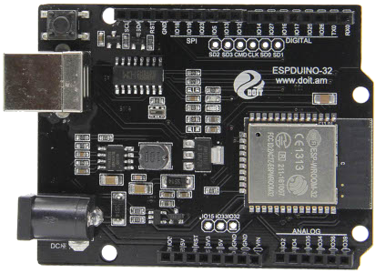
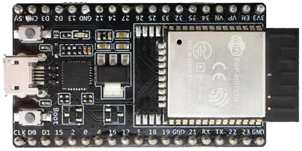
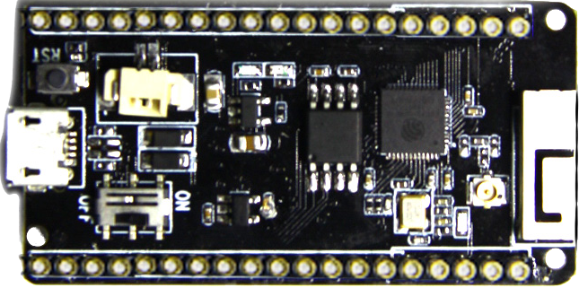
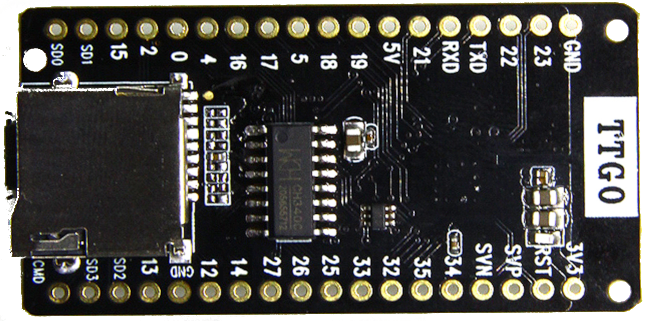
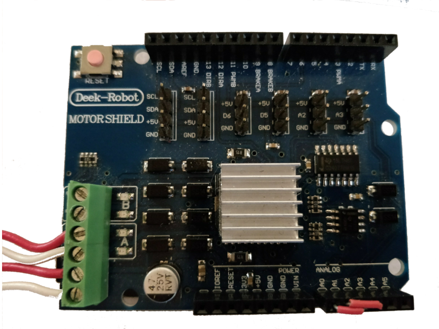
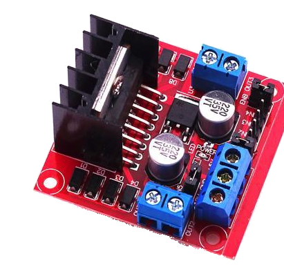
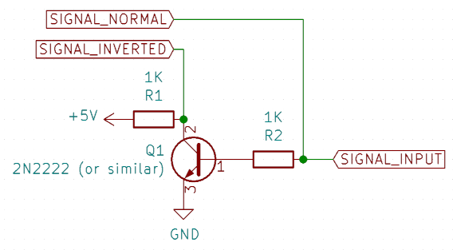
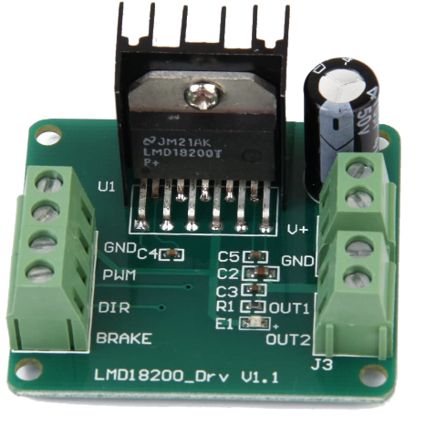

# ESP32 Command Station Supported Hardware

The ESP32 Command Station supports many configurations, some of which can be
automatically configured by the `menuconfig` utility.

## Supported ESP32 Models

The ESP32 Command Station code is able to support almost any model of ESP32 or
ESP32-S3, provided there are sufficient GPIO pins available.

### ESPDuino-32

The ESPDuino-32 uses an ESP-WROOM-32 SoC in an Arduino UNO form-factor. This is
a very easy to use ESP32 board that interfaces very well with the
[Arduino Motor Shield](#arduino-motor-shield-L298).

**NOTE:** There have been reports that this board may not always enter download
mode. If the board does not enter download mode automatically connect a jumper
wire from IO0 (pin closest to barrel jack) to GND (second and third pin from
right in the same pin header) for downloading firmware and remove for normal
operations.

When pairing this with the [Arduino Motor Shield](#arduino-motor-shield-L298)
or compatible L298 modules, please refer to [Arduino Motor Shield Required Jumpers](#arduino-motor-shield-required-jumpers)
for details on required jumpers.

### Espressif ESP32 DevKit-C

The Espressif ESP32 DevKit-C boards are a great option but require many jumper
wires to connect the ESP32 with the h-bridge(s) or other peripherals.

### LilyGo TTGO-T1

The LilyGo [TTGO-T1](http://www.lilygo.cn/prod_view.aspx?TypeId=50063&Id=1109&FId=t3:50063:3)
board is an inexpensive board that has a built-in MicroSD card adapter. This is
a great alternative to the [ESPDuino-32](#ESPDuino-32) board when not using an
[Arduino Motor Shield](#arduino-motor-shield-L298). Similar to the
[Espressif ESP32 DevKit-C](#espressif-esp32-devkit-c) this board will require
many jumper wires to interface with various h-bridge(s).

 

## Supported h-bridges

ESP32 Command Station supports multiple h-bridge chips, many of which are
available in a shield or carrier board design.

### Arduino Motor Shield (L298)

The Arduino Motor Shield is built around the L298 h-bridge chip which has two
outputs (A and B), each supporting up to 2 Amps (some modifications required).

The official shield can be purchased [here](https://store-usa.arduino.cc/products/arduino-motor-shield-rev3),
there are also a number of compatible clones such as the one below:

**NOTE:** The above image has an optional heatsink attached to the L298P IC.

**NOTE:** When this shield is paired with the [ESPDuino-32](#ESPDuino-32), IO0
is the unmarked pin to the left of IOREF.

### Arduino Motor Shield Required Jumpers

Using this motor shield with ESP32 Command Station will require at least one
jumper:

| Pin 1 | Pin 2 | Notes |
| ----- | ----- | ----- |
| 12 / DIRA (ESP32: 19) | 13 / DIRB (ESP32: 18) | This is necessary as the ESP32 Command Station generates the DCC signal on **ONE** GPIO pin. |
| A0 (ESP32: 2) | A2 (ESP32: 35) | Required when using with [ESPDuino-32](#ESPDuino-32). |
| A1 (ESP32: 4) | A3 (ESP32: 34) | Required when using with [ESPDuino-32](#ESPDuino-32). |

### L298 (Generic)

There are a number of red PCBs with an L298 mounted vertically that are similar
to this one:

The are generally based on the same L298 chip that is used for the
[Arduino Motor Shield](#arduino-motor-shield-L298) but a few use the L293 IC
and is advertised as a stepper motor driver.

These require modifications and extra components to be usable, specifically:

* Current sense is **NOT** routed to any external pins!
* IN1 and IN2 must be the inverse of eachother, similarly for IN3 and IN4.

For IN1, IN2, IN3, IN4 a circuit similar to this can be used:

Alternatively a 74HC08 IC can be used to invert the signal.

### LMD18200T

The LMD18200T provides up to 3 Amps for **ONE** track output. This h-bridge
requires only four connections to the ESP32:

* GND
* PWM (enable pin)
* DIR (DCC signal pin)
* BRAKE

Unfortunately most PCBs do not expose the current sense pin (8) and connect
this directly to GND or not connected at all!

### DRV8873

The DRV8873 can provide 5-10 Amps for **ONE** track output. This h-bridge is
suitable for RailCom cut-out generation.

This h-bridge is not available in a commercial breakout board at this time.

### DRV8800/DRV8801

The DRV8800 / DRV8801 can provide up to 2.8 Amps for **ONE** track output. This
h-bridge is suitable for RailCom cut-out generation.

Pololu offers the [DRV8801](https://www.pololu.com/product/2136) as a breakout
board and can be used with the following connections:

* VDD to 3v3.
* DIR to DCC signal pin.
* PWM to track enable pin.
* VMM to track power supply (minimum 12v DC)
* OUT - and OUT + to track.
* BRK to track brake pin, if RailCom cut-out is enabled otherwise no connection.

### Pololu MC33926

The MC33926 based shield and carriers from Pololu can provide up to 2.5 Amps on
**TWO** track outputs.

This is not a recommended h-bridge as there are built-in circuit breakers which
can trip when a short occurs and the ESP32 will not know.

### BTS7960B (IBT_2)

The BTS7960B (usually referred to as IBT_2) can provide up to 43 Amps for **ONE**
track output.

This is not a recommended h-bridge due to the high amperage rating and no
reliable/accurate way to limit the current to lower levels.

## External Displays

The ESP32 Command Station supports connecting an I2C based display which is
used to display real-time data from the running system.

### SH1106 / SSD1306 OLED Displays

The SH1106 or SSD1306 OLED displays are fairly inexpensive and come in a
variety of shapes and sizes. The preferred size is 128x64 pixels. 

### LCD Displays

There are many options available with two or four lines with either sixteen or
twenty columns. The preferred size is twenty columns and four lines.

[home](README.md)