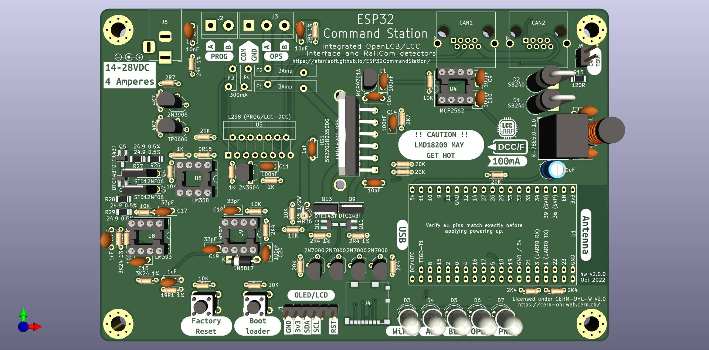
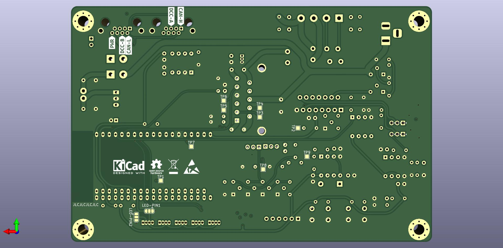

# ESP32 Command Station PCB
The ESP32 Command Station works quite well with off the shelf components, however you must pick and choose functionality based on available components or you need to assemble a mess of jumper wires to have a complete package. This PCB provides a single board solution for the ESP32 Command Station project based on either the TTGO-T1 ESP32 module or the ESP32 DevKit-C module with all components on-board to provided:

* OPS Track output (5 Amp) supporting RailCom detection.
* PROG Track output (250 mA).
* Native OpenLCB (LCC) interface with integrated Power Station interface (including RailCom feedback from boosters).
* I2C interface for OLED/LCD display usage.
* Single Power Supply interface with reverse polarity protection.

## PCB
The PCB has been designed utilizing a combination of SMD and through-hole components.

Below is a rendering of the ESP32 Command Station PCB:

### Gerber files
These can be used with any PCB manufacturing company.

* v2.0.0 - Coming soon

## Schematic and BOM

* The schematic is available [here (PDF)](cs-v2.0-THT.pdf).
* The BOM can be viewed [here](cs-v2.0-THT-BOM.html).

## PCB Availability
Due to the costs involved in a production run of the PCBs they will only be available in a few forms:
* Raw Gerber files (will require both SMD and through-hole components to be soldered)
* Partially assembled (all SMD components soldered, all through-hole components ready to be soldered)
* Fully assembled (all SMD and through-hole components soldered)

## ESP32 Pin Usage
The PCB uses almost every pin available on the TTGO-T1/DevKit-C module.

| GPIO Pin | Usage |
| -------- | ----- |
| 0 | OLED-RESET |
| 1 | UART0 TX (USB only) |
| 2 | SD-MISO |
| 3 | UART0 RX (USB only) |
| 4 | TWAI RX |
| 5 | TWAI TX |
| 6-11 | NOT AVAILABLE (connected to on chip flash) |
| 12 | RAILCOM ENABLE |
| 13 | SD-CS |
| 14 | SD-CLK |
| 15 | SD-MOSI |
| 16 | DCC SIGNAL |
| 17 | OPS DCC ENABLE |
| 18 | PROG DCC ENABLE |
| 19 | NOT USED |
| 20 | NOT AVAILABLE |
| 21 | I2C - SCL |
| 22 | Status LEDs (APA106/WS2812) |
| 23 | I2C - SDA |
| 24 | NOT AVAILABLE |
| 25 | NOT UESD |
| 26 | RAILCOM DATA |
| 27 | OPS BRAKE |
| 28-31 | NOT AVAILABLE |
| 32 | FACTORY RESET |
| 33 | BOTLOADER REQUEST |
| 34 | OPS THERM |
| 35 | AMBIENT TEMP SENSOR |
| 36 (SVP) | OPS CURRENT SENSE |
| 37 | NOT AVAILABLE |
| 38 | NOT AVAILABLE |
| 39 (SVP) | PROG CURRENT SENSE |

## DCC Limits

| Track | Current Limit | h-bridge | PTC Fuse |
| ----- | ------------- | -------- | -------- |
| OPS | 3A | [LMD18200T](https://www.ti.com/lit/ds/symlink/lmd18200.pdf) | [0ZRC0300FF1A](https://www.belfuse.com/resources/datasheets/circuitprotection/ds-cp-0zrc-series.pdf) 3A (hold) 6A (trip) |
| PROG & LCC | 250mA | [L298](https://www.st.com/resource/en/datasheet/l298.pdf) | [0ZRC0030FF1E](https://www.belfuse.com/resources/datasheets/circuitprotection/ds-cp-0zrc-series.pdf) 300mA (hold), 600mA (trip)  |

### Power Supply requirements
The DC Barrel jack connection supplies power to the DCC track outputs and the PCB itself when not connected to a powered OpenLCB (LCC) bus. It is recommended to use a 14-28v DC power supply rated for 4 Amps. The LMD18200 and L298 h-bridges will reduce the power by approximately 1 volt, with a 14 volt power supply the track should receive approximately 13 volts.

## Status LEDs
GPIO 22 is connected to five APA106 (or similar) RGB LEDs.

| LED | Usage | Output Details |
| --- | ----- | -------------- |
| 1 | WiFi Station Status | Green - Connected Green (flashing) - Connecting Red - Disconnected |
| 2 | WiFi SoftAP Status | Blue - SoftAP Active Blue (flashing) - Starting Red - Disconnected |
| 3 | Bootloader Active | Green - Active  Clear/Off - Inactive |
| 4 | OPS Track Status | Green - On  Clear/Off - Off Yellow - 75% utilization Red - Fault/Short |
| 5 | PROG Track Status | Green - On  Clear/Off - Off Red - Fault/Short |

Flashing LEDs use an on/off frequency of 450ms-500ms.

Note that if the ESP32 Command Station detects that a crash occurred prior to the current startup attempt it will configure the LEDs to blink in an alternating red and yellow pattern. During the first 15 seconds if the Factory Reset button is pressed the ESP32 Command Station will clear the crash details and proceed with normal startup. If no button is pressed the ESP32 Command Station will remain in the alternating light pattern indefinitely. If the code is built using ESP-IDF v4.4 or later the crash details will be convered to a text file and stored on the SD card as "coredump.txt", if no SD card is in use it will be persisted in SPIFFS.

## Factory Reset button behavior
During startup the ESP32 Command Station will check for the factory reset button being held and the bootloader request button not being held. The Status LEDs will blink green in an alternating pattern. If the Factory Reset button is held for up to five seconds the OpenLCB (LCC) events will be regenerated. If the Factory Reset button is held for more than ten seconds persistent configuration data will be cleared, note that the NVS persistent configuration will not be cleared.

## Bootloader Request button behavior
During startup the ESP32 Command Station will check for the bootloader request button being held and the factory reset button not held. If this condition is met the Bootloader Active Status LED will blink red for one second to acknowledge the request. The ESP32 Command Station will require a reboot to return to normal operating behavior after entering the bootloader.

## Core Dump detection behavior
During startup the ESP32 Command Station will check for presence of a core dump from a previous crash. If one is detected the Status LEDs will blink yellow and red in an alternating pattern. The default behavior is to wait for up to 15 seconds for the factory reset button to be pressed (while Status LEDs are yellow) to clear the core dump and proceed with normal startup. If the core dump is not cleared after 15 seconds the ESP32 will halt normal startup and leave the Status LEDs in a blinking yellow pattern.

[Return to ESP32 Command Station](./index.html)
