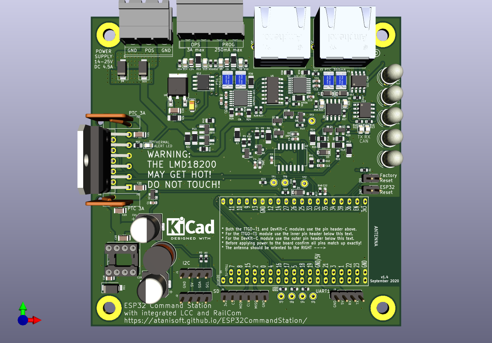

# ESP32 Command Station PCB
The ESP32 Command Station works quite well with off the shelf components, however you must pick and choose functionality based on available components or you need to assemble a mess of jumper wires to have a complete package. This PCB provides a single board solution for the ESP32 Command Station project based on either the TTGO-T1 ESP32 module or the ESP32 DevKit-C module with all components on-board to provided:

* OPS Track output (3 Amp) supporting RailCom detection.
* PROG Track output (250 mA).
* Native LCC interface with two RJ45 ports.
* Two I2C interfaces for OLED/LCD display usage (additional usages may be developed in the future).
* UART interface for LocoNet or Nextion display usage.
* Single Power Supply interface with reverse polarity protection.

## PCB
The PCB has been designed utilizing a combination of SMD and through-hole components.

Below is a rendering of the ESP32 Command Station PCB:

### Gerber files
These can be used with any PCB manufacturing company.

* v1.3 - Coming soon

### PCB Assembly (PCBA)
Some PCB manufacturers are offering assembly of the PCBs before delivery. Currently the files below are suitable only for JLCPCB, other manufacturers may be supported in the future.

* v1.3 - Coming soon

## Schematic and BOM

* The schematic is available [here (PDF)](ESP32-CS.pdf).
* The BOM can be viewed [here](ESP32-CS-BOM.html).

## PCB Availability
Due to the costs involved in a production run of the PCBs they will only be available in a few forms:
* Raw Gerber files (will require both SMD and through-hole components to be soldered)
* Partially assembled (all SMD components soldered, all through-hole components ready to be soldered)
* Fully assembled (all SMD and through-hole components soldered)

## ESP32 Pin Usage
The PCB uses almost every pin available on the TTGO-T1/DevKit-C module.

| GPIO Pin | Usage |
| -------- | ----- |
| 0 | Unused |
| 1 | UART0 TX |
| 2 | SD-MISO |
| 3 | UART0 RX |
| 4 | OPS DCC ENABLE |
| 5 | UART1 TX |
| 6-11 | NOT AVAILABLE (connected to on chip flash) |
| 12 | MTDI |
| 13 | SD-CS |
| 14 | SD-CLK |
| 15 | SD-MOSI |
| 16 | UART1 RX |
| 17 | OPS DCC SIGNAL |
| 18 | PROG DCC ENABLE |
| 19 | PROG DCC SIGNAL |
| 20 | NOT AVAILABLE |
| 21 | I2C - SCL |
| 22 | Status LEDs (APA106/WS2812) |
| 23 | I2C - SDA |
| 24 | NOT AVAILABLE |
| 25 | RAILCOM BRAKE |
| 26 | RAILCOM DIRECTION |
| 27 | RAILCOM ENABLE |
| 28-31 | NOT AVAILABLE |
| 32 | CAN TX |
| 33 | RAILCOM DATA |
| 34 | FACTORY RESET |
| 35 | CAN RX |
| 36 (SVP) | OPS CURRENT SENSE |
| 37 | NOT AVAILABLE |
| 38 | NOT AVAILABLE |
| 39 (SVP) | PROG CURRENT SENSE |

## DCC signal capabilities

| Track | Current Limit | h-bridge | PTC Fuse |
| ----- | ------------- | -------- | -------- |
| OPS | approximately 2.85A | [LMD18200](https://www.ti.com/lit/ds/symlink/lmd18200.pdf) | [0ZRB0300FF1A datasheet](https://www.mouser.com/datasheet/2/643/ds-CP-0zrb-series-1664140.pdf) 3A (hold), 6A (trip) |
| PROG | 250mA | [DRV8801](https://www.ti.com/lit/ds/symlink/drv8801.pdf) | [0ZCG0035AF2C datasheet](https://www.mouser.com/datasheet/2/643/0ZCG_Nov2016-1132141.pdf) 350mA (hold), 700mA (trip)  |
| LCC | 250mA | [DRV8801](https://www.ti.com/lit/ds/symlink/drv8801.pdf) | [0ZCG0035AF2C datasheet](https://www.mouser.com/datasheet/2/643/0ZCG_Nov2016-1132141.pdf) 350mA (hold), 700mA (trip) |

### DCC Power Supply requirements
The DCC-POWER connections supply power to the DCC track outputs as well as the PCB itself. It is recommended to use a 14-18v DC power supply rated for 5 Amps. The LMD18200 and DRV8801 h-bridges used by the PCB will reduce the track output voltage by approximately 2v compared to the DCC-POWER supply voltage.

## Status LEDs
GPIO 22 is connected to five APA106/WS2812 (or similar) RGB LEDs. APA106 and WS2812 use different pin assignments for GND and 5V, care must be taken to account for this.

| LED | Usage | Output Details |
| --- | ----- | -------------- |
| 1 | WiFi Status | Green - Connected Green (flashing) - Connecting Red - Disconnected Blue - SoftAP Active |
| 2 | OPS Track Status | Green - On  Clear/Off - Off Red - Fault/Short |
| 2 | PROG Track Status | Green - On  Clear/Off - Off Red - Fault/Short |
| EXT-1 | TBD | TBD |
| EXT-2 | TBD | TBD |

Flashing LEDs use an on/off frequency of 450ms-500ms.

### LED 5V and GND pin connections
There are currently two common pin assignments for the RGB LEDs supported by the Command Station. The 5V and GND pins are swapped depending on the specific type of LED being used and who manufactured it. The WS2812 based LEDs are typically (1) DATA IN, (2) GND, (3) 5V, (4) DATA OUT. The APA106 LEDs are typically (1) DATA IN, (2) 5V, (3) GND, (4) DATA OUT.

The LED-PIN2 and LED-PIN3 solder jumper pads on the back side of the PCB can be used to switch the LED pins to match the LEDs being used, these default to the APA106 pin assignment.

The LEDs included in the PCB kit are F5 diffused APA106 LEDs.

## Expansion Interfaces
The PCB has four expansion ports available for optional features:

| Port | Usage |
| ---- | ----- |
| I2C | OLED or LCD Screen. |
| UART1 | Nextion Interface, LocoNet Interface. These are planned for the future and are not currently supported. |
| SD-Module | When using the ESP32 DevKit-C module it is highly recommended to use an SD card adapter module to reduce wear on the ESP32 built-in flash by the SPIFFS filesystem. |

[Return to ESP32 Command Station](./index.html)
