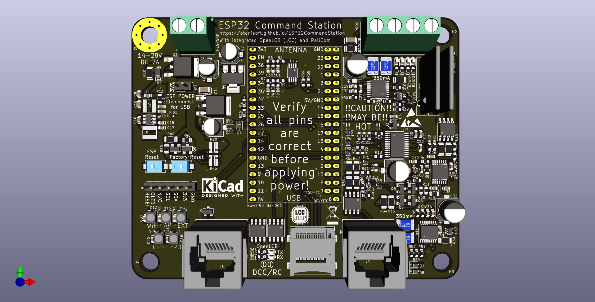
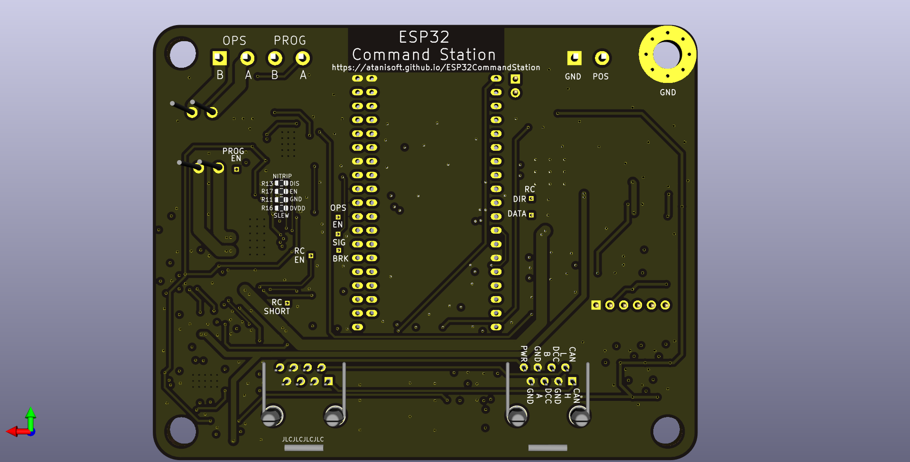

# ESP32 Command Station PCB
The ESP32 Command Station works quite well with off the shelf components, however you must pick and choose functionality based on available components or you need to assemble a mess of jumper wires to have a complete package. This PCB provides a single board solution for the ESP32 Command Station project based on either the TTGO-T1 ESP32 module or the ESP32 DevKit-C module with all components on-board to provided:

* OPS Track output (5 Amp) supporting RailCom detection.
* PROG Track output (250 mA).
* Native OpenLCB (LCC) interface with integrated Power Station interface (including RailCom feedback from boosters).
* I2C interface for OLED/LCD display usage.
* Single Power Supply interface with reverse polarity protection.

## PCB
The PCB has been designed utilizing a combination of SMD and through-hole components.

Below is a rendering of the ESP32 Command Station PCB:

### Gerber files
These can be used with any PCB manufacturing company.

* v1.5.1 - Coming soon

### PCBA Services
Some PCB manufactures offer PCBA. The files below can possibly be used for such purposes:

* v1.5.1 - Coming soon

## Schematic and BOM

* The schematic is available [here (PDF)](esp32cspcb.pdf).
* The BOM can be viewed [here](pcb-BOM.html).

## PCB Availability
Due to the costs involved in a production run of the PCBs they will only be available in a few forms:
* Raw Gerber files (will require both SMD and through-hole components to be soldered)
* Partially assembled (all SMD components soldered, all through-hole components ready to be soldered)
* Fully assembled (all SMD and through-hole components soldered)

## ESP32 Pin Usage
The PCB uses almost every pin available on the TTGO-T1/DevKit-C module.

| GPIO Pin | Usage |
| -------- | ----- |
| 0 | OLED-RESET |
| 1 | UART0 TX (USB only) |
| 2 | SD-MISO |
| 3 | UART0 RX (USB only) |
| 4 | TWAI RX |
| 5 | TWAI TX |
| 6-11 | NOT AVAILABLE (connected to on chip flash) |
| 12 | RAILCOM ENABLE |
| 13 | SD-CS |
| 14 | SD-CLK |
| 15 | SD-MOSI |
| 16 | DCC SIGNAL |
| 17 | OPS DCC ENABLE |
| 18 | PROG DCC ENABLE |
| 19 | NOT USED |
| 20 | NOT AVAILABLE |
| 21 | I2C - SCL |
| 22 | Status LEDs (APA106/WS2812) |
| 23 | I2C - SDA |
| 24 | NOT AVAILABLE |
| 25 | RAILCOM DIRECTION |
| 26 | RAILCOM DATA |
| 27 | OPS BRAKE |
| 28-31 | NOT AVAILABLE |
| 32 | FACTORY RESET |
| 33 | BOTLOADER REQUEST |
| 34 | OPS FAULT |
| 35 | AMBIENT TEMP SENSOR |
| 36 (SVP) | OPS CURRENT SENSE |
| 37 | NOT AVAILABLE |
| 38 | NOT AVAILABLE |
| 39 (SVP) | PROG CURRENT SENSE |

## DCC Limits

| Track | Current Limit | h-bridge | PTC Fuse |
| ----- | ------------- | -------- | -------- |
| OPS | 5A (software limited) | [DRV8873](https://www.ti.com/lit/ds/symlink/drv8873.pdf) | [MF-R500-2 datasheet](https://www.mouser.com/datasheet/2/54/mfr-777680.pdf) 5A (hold), 10A (trip) |
| PROG | 250mA | [DRV8801](https://www.ti.com/lit/ds/symlink/drv8801.pdf) | [0ZCG0035AF2C datasheet](https://www.mouser.com/datasheet/2/643/0ZCG_Nov2016-1132141.pdf) 350mA (hold), 700mA (trip)  |
| LCC | 250mA | [DRV8801](https://www.ti.com/lit/ds/symlink/drv8801.pdf) | [0ZCG0035AF2C datasheet](https://www.mouser.com/datasheet/2/643/0ZCG_Nov2016-1132141.pdf) 350mA (hold), 700mA (trip) |

### OPS Track hardware limit
The DRV8873 defaults to a 6.5A short circuit limit and can be controlled via the nITRIP solder pads on the back side of the PCB. When enabled (default) and the 6.5A limit is breached the OPS track will be disabled until a power cycle.

### DCC Power Supply requirements
The DCC-POWER connections supply power to the DCC track outputs as well as the PCB itself. It is recommended to use a 14-18v DC power supply rated for 7 Amps. The DRV8873 and DRV8801 h-bridges used by the PCB will reduce the track output voltage by approximately 2v compared to the DCC-POWER supply voltage.

## Status LEDs
GPIO 22 is connected to five TX1812 (or similar) RGB LEDs.

| LED | Usage | Output Details |
| --- | ----- | -------------- |
| 1 | WiFi Station Status | Green - Connected Green (flashing) - Connecting Red - Disconnected |
| 2 | WiFi SoftAP Status | Blue - SoftAP Active Blue (flashing) - Starting Red - Disconnected |
| 3 | Bootloader Active | Green - On  Clear/Off - Off Red - Fault/Short |
| 4 | OPS Track Status | Green - On  Clear/Off - Off Yellow - 75% utilization Red - Fault/Short |
| 5 | PROG Track Status | Green - On  Clear/Off - Off Red - Fault/Short |

Flashing LEDs use an on/off frequency of 450ms-500ms.

## Factory Reset button behavior
During startup the ESP32 Command Station will check for the factory reset button being held and the bootloader request button not being held. The Status LEDs will blink green in an alternating pattern. If the Factory Reset button is held for up to five seconds the OpenLCB (LCC) events will be regenerated. If the Factory Reset button is held for more than ten seconds persistent configuration data will be cleared, note that the NVS persistent configuration will not be cleared.

## Bootloader Request button behavior
During startup the ESP32 Command Station will check for the bootloader request button being held and the factory reset button not held. If this condition is met the Bootloader Active Status LED will blink red for one second to acknowledge the request. The ESP32 Command Station will require a reboot to return to normal operating behavior after entering the bootloader.

## Core Dump detection behavior
During startup the ESP32 Command Station will check for presence of a core dump from a previous crash. If one is detected the Status LEDs will blink yellow in an alternating pattern. The default behavior is to wait for up to 15 seconds for the factory reset button to be pressed (while Status LEDs are yellow) to clear the core dump and proceed with normal startup. If the core dump is not cleared after 15 seconds the ESP32 will halt normal startup and leave the Status LEDs in a blinking yellow pattern.

[Return to ESP32 Command Station](./index.html)
